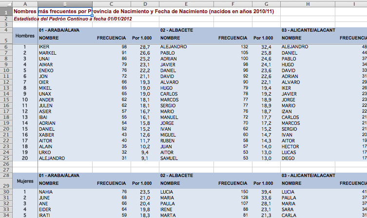
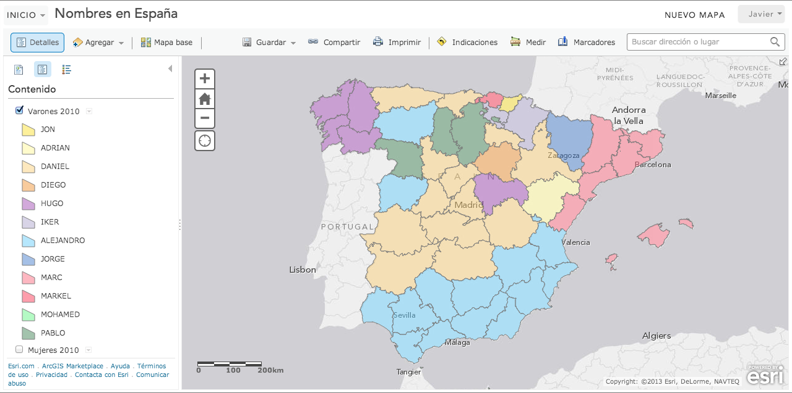

# Step 1 - Data preparation

First, download the original data from the INE (Spanish Statistics Agency) [website](http://www.ine.es/daco/daco42/nombyapel/nombyapel.htm). The file I chose to download was [Nombres más frecuentes por fecha de nacimiento y provincia de nacimiento](http://www.ine.es/daco/daco42/nombyapel/nombres_por_fecha.xls)

The structure of the file is a bit different of what we need, so I decided to write a Python script to extract and format the data.

First, I prepared a small script that iterates through the relevant sheets of the workbook, skiping the index and summary sheets that are also included in the file.

	import xlrd
	import csv
	
	book = xlrd.open_workbook("nombres_por_fecha.xls")

	sheetNames = [
		(u"NACIDOS ANTES DE 1930",1920),
		(u"NACIDOS EN AÑOS 30",1930),
		(u"NACIDOS EN AÑOS 40",1940),
		(u"NACIDOS EN AÑOS 50",1950),
		(u"NACIDOS EN AÑOS 60",1960),
		(u"NACIDOS EN AÑOS 70",1970),
		(u"NACIDOS EN AÑOS 80",1980),
		(u"NACIDOS EN AÑOS 90",1990),
		(u"NACIDOS EN AÑOS 2000",2000),
		(u"NACIDOS EN AÑOS 2010",2010)
	];

	for (sheetName,year) in sheetNames:
		sheet = book.sheet_by_name(sheetName);
		convertSheet(sheet,year);

For each of the sheets, we extract the data (fortunately it's the same layout in each of the sheets) and dump it to a CSV file (separated by semi-colons, as some of the provincia names contain commas)

	def convertSheet(sheet,year):
		csvName = "d%04d.csv" % year
		print sheet.name,"->", csvName;
		with open( csvName, "w") as fp:
			writer = csv.writer(fp,delimiter=';')
			writer.writerow(["CODIGO","PROVINCIA","VARON","MUJER"])

			titleRowIndex = 3
			maleNameRowIndex = 5
			femaleNameRowIndex = 29
			for colIndex in range(1,sheet.ncols,3):
				(code,provincia) = sheet.cell(titleRowIndex,colIndex).value.split(' - ')
				varon = sheet.cell(maleNameRowIndex,colIndex).value
				mujer = sheet.cell(femaleNameRowIndex,colIndex).value
				writer.writerow([s.encode('utf-8') for s in [code,provincia,varon,mujer]])

So far, we only have alphanumeric data. We need some geographic data to create a map. I searched in [www.comunidadsig.com](www.comunidadsig.com) and found a shapefile of the spanish Provincias in web mercator projection [Provincias- WGS84 Web Mercator](http://www.arcgis.com/home/item.html?id=d286b2d892384b84b2c44b06766380ef)
Now we need to join our alphanumeric data with the geographic data somehow:

* ArcGIS for Desktop:
* QGIS: 
* OGR2OGR ?
* Excel

#Step 2 - The Map
In ArcGIS Online, I uploaded the provincias2010.zip file that contains all provincias2010.* (shp,shx,prj,dbf) files.

I configured the layer pop-up (to show only the Provincia name in the title and the Male and Female most frequent names) and symbology (Unique Symbols on VARON (male) field).

Once I had the layer ready, I copied it and changed the field for the Unique Symbols renderer to MUJER (female) field.

Finally, I set the Gray Canvas basemap as the background layer. 

The result is a map with a gray basemap, and two feature layers, one for male names and other for female names.

#Step 3 - The App